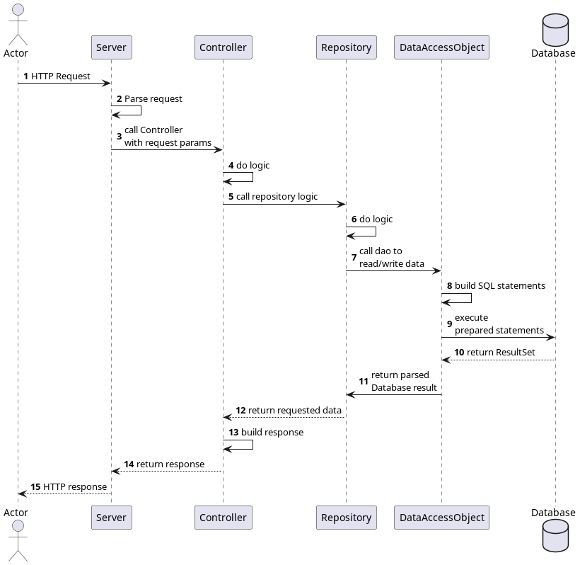

<div align="center">
    <h1>Monster Trading Card Game</h1>
    <p>This REST-based server is built to be a platform for trading and battling with and
against each other in a magical card game world.

This project was the semester project in the third semester of my cs studies.</p>
    <a target="_blank" href="https://github.com/Oscavian/trading-card-game/actions"></a>
    <a target="_blank" href="https://github.com/Oscavian/trading-card-game/commits/master"></a>
</div>


## Design
My version of the monster trading card game is a multithreaded REST-based HTTP-Server that acts like an API.
Requests are parsed by the Server, then handed to the Game, which calls the associated Controller, which further calls the respective Repositories.
The Repositories encapsulate the database access code implemented as Data Access Objects (DAOs).
Due to injecting dependencies, unit testing was fairly easy.

### Sequence diagram



## Database

I used a PostgreSQL database running inside a docker container.

## Usage

This setup is meant to run on a single machine. I might wrap the application in a container too in the future.

1. configure the following environment variables for the database connection with values of your choice
    ```shell
    export \
    POSTGRES_USER=<dbuser> \
    POSTGRES_PASSWORD=<dbpassword> \
    POSTGRES_URL=localhost:<port> \
    POSTGRES_DB=<dbname>
    ```
2. build the custom postgres docker image
    ```shell
    cd trading-card-game
    docker build --build-arg PW=$POSTGRES_PASSWORD --build-arg USER=$POSTGRES_USER --build-arg DB=$POSTGRES_DB -t mtcgdb db/
    ```
3. start the db container
    ```shell
    docker run --detach --name swen1db -p <port>:5432 -v data:/var/lib/postgresql/data mtcgdb
    ```

## Protocol
The whole protocol I wrote for this project can be found [here](docs/protocol.md)