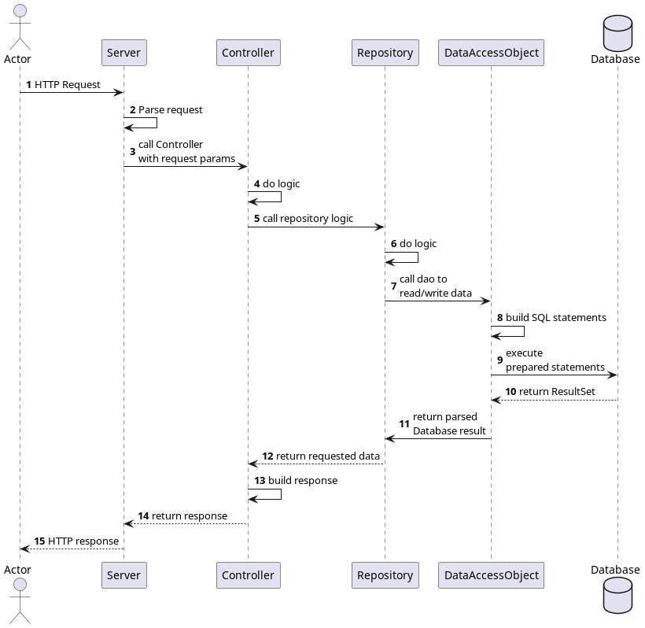

# Design
My version of the monster-trading-card-com.oscavian.tradingcardgame.game is (who would've guessed) a multithreaded REST-based HTTP-Server that acts like an API.
Requests are parsed by the Server, then handed to the Game, which calls the associated Controller, which further calls the respective Repositories.
The Repositories encapsulate the database access code implemented as Data Access Objects (DAOs).
Due to injecting dependencies, unit testing was fairly easy.

### Sequence diagram

## Database

I used a PostgreSQL database running inside a docker container.

# Unit Test decisions

The relevant business logic is mostly handled by the controllers & repositories, so I mostly tested those.
I used Mockito to mock the dependencies, e.g. the repository called by a controller.
Due to time limitation I wasn't able to write tests for all methods.

# Lessons learned

As this was my first bigger software project I implemented all by myself, I have learned quite a lot.
Not only how it feels like to be confronted with lots of requirements you are not really sure about how to achieve them,
but also how helpful a design pattern can be to eliminate the initial confusion.
Speaking of design patterns, I tried to apply the Controller/Repository/DAO pattern which went pretty well, because once I understood it, adding more features and routes became a lot easier.
On the contrary, considering that after all there were not THAT many routes to implement, the boilerplate code needed for this pattern sometimes was a little painful to write.
It also was my first time working in a somewhat concurrent environment and even though there weren't that many concurrency pitfalls, they were a good opportunity to inform myself about Synchronization, Futures and so on.

In conclusion, I did enjoy writing the software, even though we had to implement a lot by ourselves, and it was a little stressful in the end.

# Unique Feature

For my unique feature I didn't do something about the battle, but about performance.
Inspired by my lecturers showcase of the repository pattern, where he "cached" the data retrieved from the DAO into a HashMap, I tried to write a more sophisticated caching service to reduce the database queries.
My solution works the following way:

The Class `CacheService` consists of:
* Fields representing the cache for a specific resource (typically a model). Due to the concurrent design of the application, I chose the `ConcurrentHashMap<ID, T>` as type. 
* A parameterized `refresh()` method to overwrite an old cache map with a newer one. It first prunes all entries from the old cache not present in the new cache. It then replaces all values that are not equal to their ancestor with the newer one.
* Every cache then has a respective refresh method which calls the `refresh()`-method.

Every repository is given the same Instance of the `CacheService` object, so they can retrieve data from all caches.
Only the repository responsible for the cached resource (by using the respective DAO) refreshes the cache after a CREATE, UPDATE or DELETE action on that resource has happened. At initialization, the repository refreshes its cache too, to fetch pre-existing data.

This approach has the following advantage: READ operations are significantly faster than database queries because the data can be retrieved from a HashMap (O(1)) in memory using the unique identifier of the resource.
However, a disadvantage of my approach is, that for every operation except READ, there is an additional READ request to the database which refreshes the whole cache. This could probably be optimized further.

To be fair, I did not implement a cache for every resource, and did not test the processing time in detail, but it was worth a try from my perspective.

## Time tracker
| Date       | Time spent | Activity                                                                 |
|------------|------------|--------------------------------------------------------------------------|
| 14.09.2022 | 1.5h       | First UML Mockup                                                         |
| 15.10.2022 | 2.5h       | HTTP Server implementation                                               |
| 16.10.2022 | 2h         | First MVC implementation                                                 |
 | 18.10.2022 | 1.5h       | First POST request, second GET request                                   |
| 25.10.2022 | 1h         | Make com.oscavian.tradingcardgame.server multithreaded                                                |
| 09.12.2022 | 5h         | Implement first DAOs and Repos                                           |
| 10.12.2022 | 2.5h       | Implement POST /users                                                    |
| 11.12.2022 | 1h         | Implement PUT /users                                                     |
| 27.12.2022 | 2h         | Database mockup                                                          |
| 28.12.2022 | 1h         | Database DDL created                                                     |
| 30.12.2022 | 3h         | Add routes to com.oscavian.tradingcardgame.game, adapt Repository template, began on Card Routes      |
| 02.01.2023 | 6h         | Add auth service, caching service, route GET /cards                      |
| 3.01.2023  | 6h         | Implement GET /decks and PUT /decks                                      |
| 4.01.2023  | 6h         | Bugfixes, implement POST /packages & POST /transactions/packages         |
| 5.01.2023  | 4h         | Unit tests written                                                       |
| 06.01.2023 | 4h         | Battle logic, Thread sync                                                |
| 07.01.2023 | 6h         | Implement GET /stats & GET /scores, Bugfixes regarding integration tests |
| 09.01.2023 | 5h         | Finish battle logic, add further unit tests                              | 
| 10.01.2023 | 5h         | Finish protocol & last tweaks                                            |

**Sum: ~70 hours**

## Link to public repository

https://github.com/Oscavian/trading-card-com.oscavian.tradingcardgame.game.git