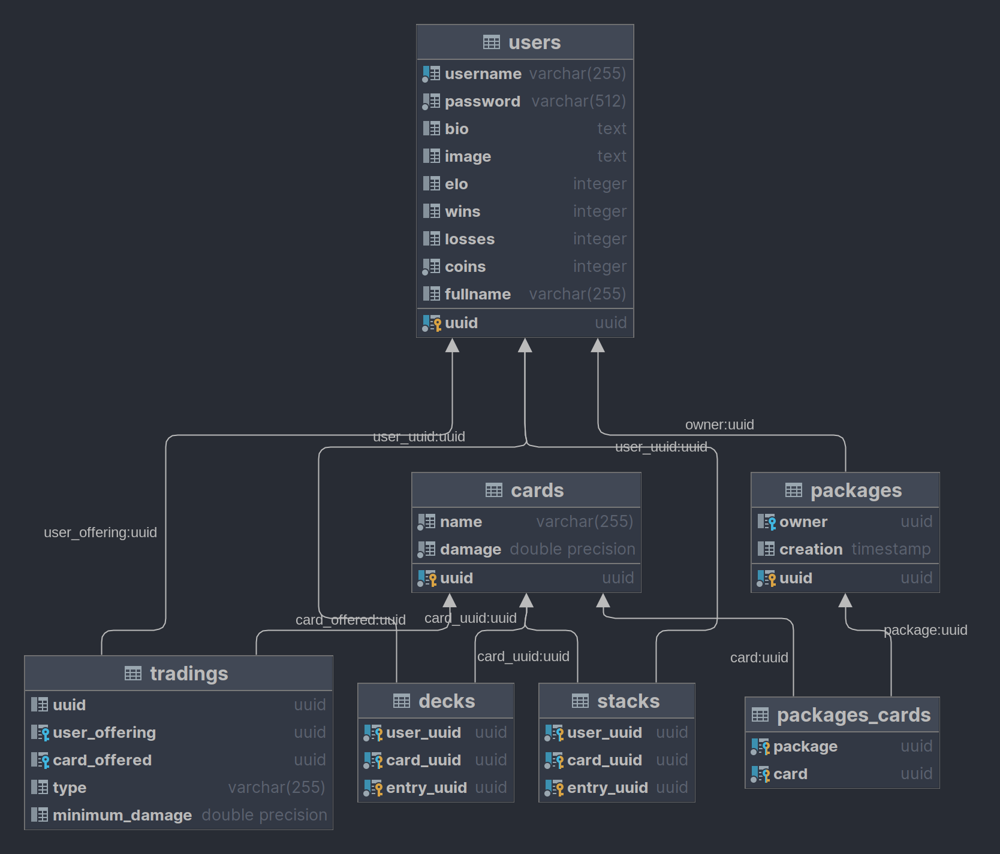

# Design

# Unit Test decisions

# Lessons learned

# Unique Feature

## Time tracker
| Date       | Time spent | Activity                                                                 |
|------------|------------|--------------------------------------------------------------------------|
| 14.09.2022 | 1.5h       | First UML Mockup                                                         |
| 15.10.2022 | 2.5h       | HTTP Server implementation                                               |
| 16.10.2022 | 2h         | First MVC implementation                                                 |
 | 18.10.2022 | 1.5h       | First POST request, second GET request                                   |
| 25.10.2022 | 1h         | Make server multithreaded                                                |
| 09.12.2022 | 5h         | Implement first DAOs and Repos                                           |
| 10.12.2022 | 2.5h       | Implement POST /users                                                    |
| 11.12.2022 | 1h         | Implement PUT /users                                                     |
| 27.12.2022 | 2h         | Database mockup                                                          |
| 28.12.2022 | 1h         | Database DDL created                                                     |
| 30.12.2022 | 3h         | Add routes to game, adapt Repository template, began on Card Routes      |
| 02.01.2023 | 6h         | Add auth service, caching service, route GET /cards                      |
| 3.01.2023  | 6h         | Implement GET /decks and PUT /decks                                      |
| 4.01.2023  | 6h         | Bugfixes, implement POST /packages & POST /transactions/packages         |
| 5.01.2023  | 4h         | Unit tests written                                                       |
| 06.01.2023 | 4h         | Battle logic, Thread sync                                                |
| 07.01.2023 | 6h         | Implement GET /stats & GET /scores, Bugfixes regarding integration tests |
| 09.01.2023 | 5h         | Finish battle logic, ass further unit tests                              | 
| 10.01.2023 |            |                                                                          |
**Sum: ~70 hours**

